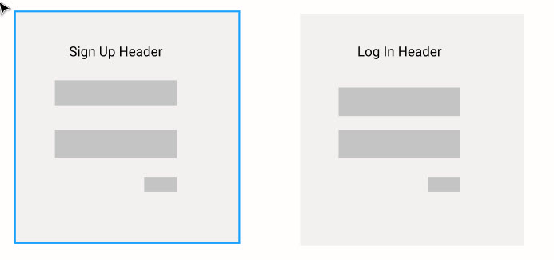
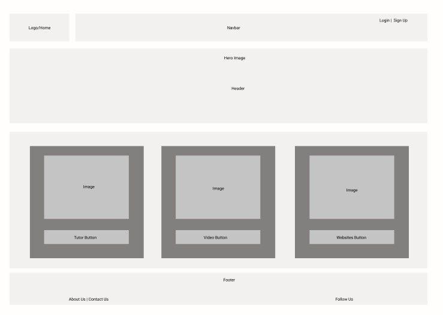
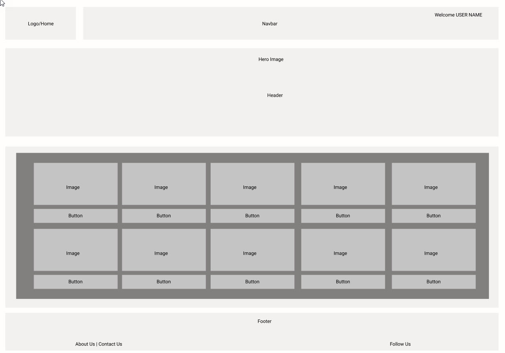

# Triple T Acedemy - Tech Turbo Tutor

# Description
Welcome to Triple T Academy where people of all ages and experince can find the coding help they need. You can find an interactive website where you can logon and find coding videos, games and tutors.  This application will help users find the tutor they need for the material they are trying to learn.

# Wire Frames
### Login & Signup Page

### Home Page layouts - Tutor

### Home Page layouts - Video & Games

# User Story
When a user hits sign in they are sent to a page to sign up.
When a user enters their sign in info it is saved to DB and they are taken to the landing page.

When a user logs in THEN landing pages shows.

When they select the tutor button they are taken to the tutor page.
When a user chooses from a drop down menu they are presented with a list of options.
when a user selects an option from the drop down list they then click the search button and see their results.

When they select the video button they are taken to the video page.
When a user chooses from a drop down menu they are presented with a list of options.
when a user selects an option from the drop down list they then click the search button and see their results.

When they select the games button they are taken to the games page.
When a user chooses from a drop down menu they are presented with a list of options.
when a user selects an option from the drop down list they then click the search button and see their results.

# Technologies

MongoDB

Bootstrap

API's - Not sure yet

React

# MVP Details week 1

Pages layed out and designed.

# Group Assignments

 Yah'Mir - API research

 Tracy - Backend Login/Signup

 Linda - Backend Tutor DB

 Luis - Front End Tutor Page
 
 Adriana - Front End Video Page

 Estefany - Front end Login/Signup

